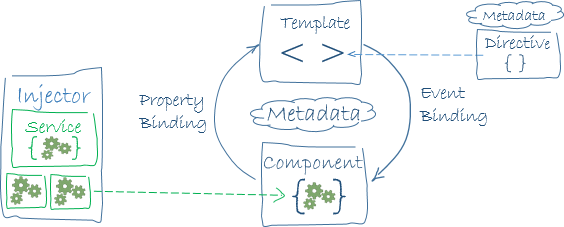

# Angular Introduction

Google's Angular framework is a popular framework that you'll come across often. In this article we look at what Angular has to offer and look at Angular's basic architecture.

## What is Angular?

Angular is a development platform, built on [TypeScript](./typescript-intro.md). As a platform, Angular includes:

- A component-based framework for building scalable web applications
- A collection of well-integrated libraries that cover a wide variety of features, including routing, forms management, client-server communication, and more
- A suite of developer tools to help you develop, build, test, and update your code

When you build applications with Angular, you're taking advantage of a platform that can scale from single-developer projects to enterprise-level applications. Angular is designed to make updating as easy as possible, so you can take advantage of the latest developments with a minimum of effort. Best of all, the Angular ecosystem consists of a diverse group of over 1.7 million developers, library authors, and content creators.

Before you start exploring the Angular platform, you should know about the [Angular CLI](https://angular.io/cli). The Angular CLI is the fastest, easiest, and recommended way to develop Angular applications. The Angular CLI makes a number of tasks easy. In this workshop we use the [NX CLI](https://nx.dev/using-nx/nx-cli) which is an extension of the Angular CLI.

You'll find the Angular CLI to be a valuable tool for building out your applications.

## Angular concepts

Here are a few Angular concepts you should be aware of:

Components are the building blocks of an Angular application.
A component includes a TypeScript class that has a `@Component()` decorator, an HTML template, and styles.

### The class

The class is where you put any logic your component needs.
This code can include functions, event listeners, properties, and references to services to name a few.
The class is in a file with a name such as `feature.component.ts`, where `feature` is the name of your component.
So, you could have files with names such as `header.component.ts`, `signup.component.ts`, or `feed.component.ts`.
You create a component with a `@Component()` decorator that has metadata that tells Angular where to find the HTML and CSS.
A typical component is as follows:

```ts
import { Component } from '@angular/core';

@Component({
  selector: 'app-item',
    // the following metadata specifies the location of the other parts of the component
  templateUrl: './item.component.html',
  styleUrls: ['./item.component.css']
})

export class ItemComponent {
// your code goes here
}
```

This component is called `ItemComponent`, and its selector is `app-item`.
You use a selector just like regular HTML tags by placing it within other templates.
When a selector is in a template, the browser renders the template of that component.
This tutorial guides you through creating two components and using one within the other.

Angular's component model offers strong encapsulation and an intuitive application structure.
Components also make your application easier to unit test and can improve the overall readability of your code.

### The HTML template

Every component has an HTML template that declares how that component renders.
You can define this template either inline or by file path.

To refer to an external HTML file, use the `templateUrl` property:

```ts
@Component({
  selector: 'app-root',
  templateUrl: './app.component.html'
})

export class AppComponent {
}
```

To write inline HTML, use the `template` property and write your HTML within backticks:

```ts
@Component({
  selector: 'app-root',
  template: `<h1>Hi!</h1>`,
})

export class AppComponent {
}
```

Angular extends HTML with additional syntax that lets you insert dynamic values from your component.
Angular automatically updates the rendered DOM when your component's state changes.
One use of this feature is inserting dynamic text, as shown in the following example.

```html
<h1>{{ title }}</h1>
```

The double curly braces instruct Angular to interpolate the contents within them.
The value for `title` comes from the component class:

```ts
import { Component } from '@angular/core';

@Component ({
  selector: 'app-root',
  templateUrl: './app.component.html',
  styleUrls: ['./app.component.css']
})

export class AppComponent {
    title = 'To do application';
}
```

When the application loads the component and its template, the browser sees the following:

```html
<h1>To do application</h1>
```

### Styles

A component can inherit global styles from the application's `styles.css` file and augment or override them with its own styles.
You can write component-specific styles directly in the `@Component()` decorator or specify the path to a CSS file.

To include the styles directly in the component decorator, use the `styles` property:

```js
@Component({
  selector: 'app-root',
  templateUrl: './app.component.html',
  styles: ['h1 { color: red; }']
})
```

Typically, a component uses styles in a separate file using the `styleUrls` property:

```js
@Component({
  selector: 'app-root',
  templateUrl: './app.component.html',
  styleUrls: ['./app.component.css']
})
```

With component-specific styles, you can organize your CSS so that it is easily maintainable and portable.

## Summary

You've learned the basics about the main building blocks of an Angular application. The following diagram shows how these basic pieces are related.



- Together, a component and template define an Angular view.
  - A decorator on a component class adds the metadata, including a pointer to the associated template.
  - Directives and binding markup in a component's template modify views based on program data and logic.
- The dependency injector provides services to a component, such as the router service that lets you define navigation among views.

If you want to read more about Angular, here are some useful links:

- [Introduction to Modules](https://angular.io/guide/architecture-modules)
- [Introduction to Components](https://angular.io/guide/architecture-components)
  - [Templates and views](https://angular.io/guide/architecture-components#templates-and-views)
  - [Component metadata](https://angular.io/guide/architecture-components#component-metadata)
  - [Data binding](https://angular.io/guide/architecture-components#data-binding)
  - [Directives](https://angular.io/guide/architecture-components#directives)
  - [Pipes](https://angular.io/guide/architecture-components#pipes)
- [Introduction to services and dependency injection](https://angular.io/guide/architecture-services)

When you're familiar with these fundamental building blocks, you can explore them in more detail in the documentation. To learn about more tools and techniques that are available to help you build and deploy Angular applications, see [Next steps: tools and techniques](https://angular.io/guide/architecture-next-steps).
