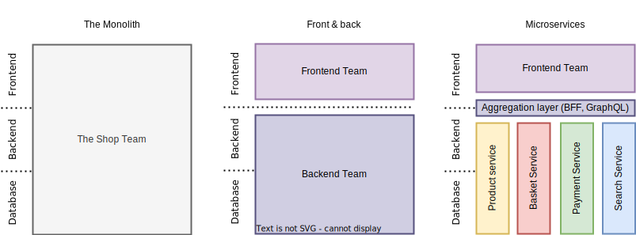
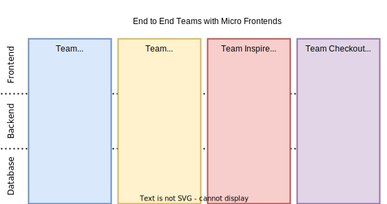
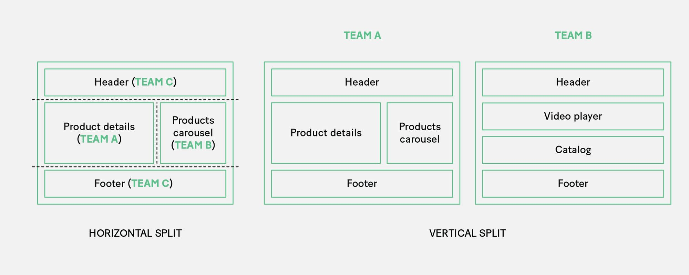

# Micro frontends

Good frontend development is hard. Scaling frontend development so that many teams can work simultaneously on a large and complex product is even harder. In this article we'll describe a recent trend of breaking up frontend monoliths into many smaller, more manageable pieces, and how this architecture can increase the effectiveness and efficiency of teams working on frontend code.

## Concept

The concept of micro-frontends has been gaining traction in recent times. The push for microservices has also brought about the same implementation to the modern web in the form of micro-frontends. As the monolith app scales, it becomes difficult to maintain, especially across several teams working on the same app.

We can look at micro-frontends as feature-based, where there are different teams and each team handles a particular feature component while another team handles something else. In the end, all teams merge the different components they have built to form one application.

Developers made use of frameworks like [single-spa](https://single-spa.js.org/) and [OpenComponents](https://opencomponents.github.io/) to achieve this, but with the new release of [webpack 5](./webpack-intro.md) and the [module federation](./module-federation.md), we can easily achieve the same goal, without an extra framework or library.

## The advantages of micro-frontends

Adopting a micro-frontend approach to building your web applications is a strategy if you are building a large-scale web application with many moving parts or applications that are branched out into sub-applications where you want some consistency in the overall look.

There are a few reasons you might want to switch to the micro-frontend approach:

- Adopting a micro-frontend approach will allow us to create an end-to-end feature architecture. This approach will allow us to develop and deploy features locally, without the need for large-scale deployment infrastructures
- With a smaller and more optimized bundle size, micro-frontends provide an overall better developer and user experience as a result of shared components and dependencies that can be lazy loaded whenever we want
- One of the biggest advantages for me is the ability for teams of developers working on that particular product to be able to pick a technology stack of their choice without fear of incompatibility with the other team’s code

## How do we split our apps?

These are some ways developers split large apps:

- **By page** ⁠— In our frontend applications, sometimes having different pages run at the same time in the browser can cause a crash in older devices, so the safest way is to split by page. If you have good routing, you can run separate, specific micro-apps for every page, which is also good for the developers on your team, because they will always work on that one page assigned to them
- **By functionality** ⁠— If you have one page with multiple things features performing different operations, you can split those big features into smaller apps and make it an independent application running that specific feature
- **By page section** ⁠— You can also split your applications by section, with different apps sharing the same section or components for example: header, footer, sidebar.

## Summary

In general, Micro Frontends only makes sense if you want to scale a project by splitting it into several smaller applications developed by different autonomous teams. If you only have one frontend team, Micro Frontend architectures are very likely an overhead.

If you want to read more about micro frontends, here are some useful links:

- [Martin Fowler Micro frontends](https://martinfowler.com/articles/micro-frontends.html)
- [ThoughtWorks Micro frontends](https://www.thoughtworks.com/radar/techniques/micro-frontends)
- [Micro-frontends in context](https://increment.com/frontend/micro-frontends-in-context/)
- <https://micro-frontends.org/>
