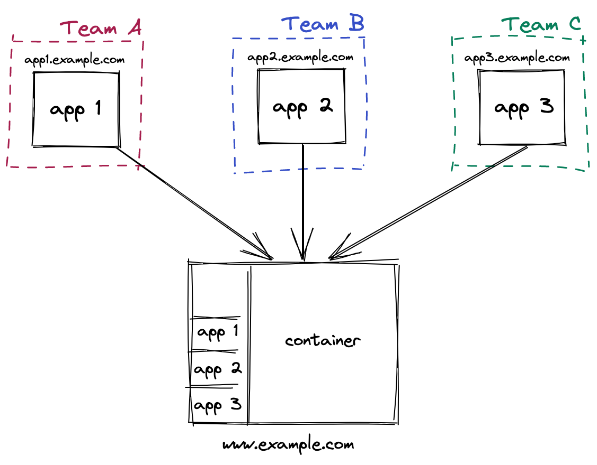

# Webpack Module Federation

Module federation allows a JavaScript application to dynamically load code from another application. In the process, sharing dependencies, if an application consuming a federated module does not have a dependency needed by the federated code. [Webpack](./webpack-intro.md) will download the missing dependency from that federated build origin.
Code is shared if it can be, but fallbacks exist in each case. Federated code can always load its dependencies but will attempt to use the consumers’ dependencies before downloading more payload. Less code duplication, dependency sharing just like a monolithic Webpack build.

## Concepts

### Module federation

same idea as Apollo GraphQL federation, but applied to JavaScript modules. In the browser and in node.js. Universal Module Federation.

### Host

a Webpack build that is initialized first during a page load (when the onLoad event is triggered)
A remote: another Webpack build, where part of it is being consumed by a _host_.

### Bidirectional-hosts

when a bundle or Webpack build can work as a _host_ or as a _remote_. Either consuming other applications or being consumed by others, at runtime.

### Omnidirectional-hosts

hosts themselves don’t know if they are host or remote on startup. This enables webpack to change out the hosts own vendors with ones based on semver rules. Allowing multiple versions when needed.

## Impact on web applications

> It’s important to note that module federation is designed so that each completely standalone build/app can be in its own repository, deployed independently, and run as its own independent SPA.

These applications are all bi-directional hosts. Any application that’s loaded first, becomes a _host_ — as you change routes and move through an application, loading federated modules in the same way you would implement dynamic imports. However if you were to refresh the page, whatever application first starts on that load, becomes a _host_.

> For example each page of a website is deployed and compiled independently. You want a micro-frontend style architecture but do not want and page reloads when changing routes, YOu also want to dynamically share code & vendors between them so it’s just as efficient as if it was one large Webpack build, with code splitting.

Landing on the home page app would make the _home_ page the _host_, if you browse to an _about_ page, the host (home page spa) is actually dynamically importing a module from another independent application (the about page spa). It doesn’t load the main entry point and another entire application. Only a few kilobytes of code. If the user on the _about_ page and refresh the browser. The _about_ page becomes the _host_ and browsing back to the home page again would be a case of the about page _host_ Fetching a fragment of runtime from a _remote_ the home page. All applications are both remote and host, consumable and consumers of any other federated module in the system.

## Summary

Module Federation allows loading separately compiled applications at runtime. Also, we can share common dependencies. This also allows sharing common data like information on the current user or global filters.

As Module Federation allows runtime integration, it is also the key for plugin systems and micro frontend architectures. However, this approach turns to compile-time dependencies into runtime dependencies; we need a sound set of integration tests to detect issues.

If you want to read more about module federation, here are some useful links:

- [Webpack 5 and Module Federation - A Microfrontend Revolution](https://dev.to/marais/webpack-5-and-module-federation-4j1i)
- [A Guide to Module Federation for Enterprise](https://dev.to/waldronmatt/tutorial-a-guide-to-module-federation-for-enterprise-n5)
- [Github Module Federation Examples](https://github.com/module-federation/module-federation-examples/)
- [Webpack dev Module Federation Introduction](https://github.com/sokra/slides/blob/master/content/ModuleFederationWebpack5.md)
- <https://webpack.js.org/concepts/module-federation/>
