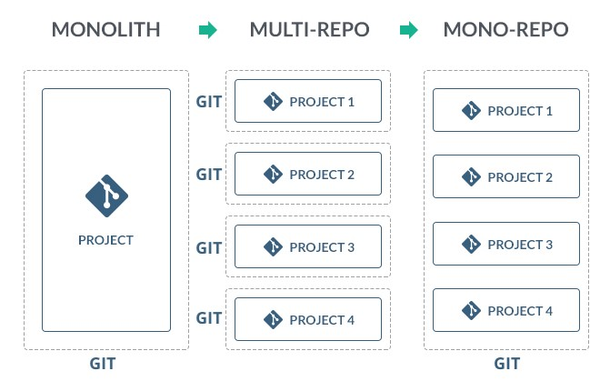

# Mono repository introduction

The most basic definition of a monorepo is that it is a single repository that consists of multiple applications and libraries. This all is accompanied by a set of tooling, which enables us to work with those
projects.

## Monorepo concepts

This approach has several benefits including:

### Shared code

it enables us to share code across the whole company or organization. This can result in code that is more DRY as we can reuse the common patterns, components, and types. This enables to share the logic between frontend and backend as well.

### Atomic changes

without the monorepo approach, whenever we need to make a change that will affect multiple projects, we might need to coordinate those changes across multiple repositories, and possibly by multiple teams. For example, an API change might need to be reflected both on a server app and a client app. With monorepo, all of those changes can be applied in one commit on one repository, which greatly limits the coordination efforts necessary

### Developer mobility

with a monorepo approach we get one consistent way of performing similar tasks even when using multiple technologies. The developers can now contribute to other teams' projects, and make sure that their changes are safe across the whole organization.

### Single set of dependencies

By using a single repository with one set of dependencies, we make sure that our whole codebase depends on one single version of the given dependency. This way, there are no version conflicts between libraries. It is also less likely that the less used part of the repository will be left with an obsolete dependency because it will be updated along the way when other parts of the repository do this update.

## Summary

If you want to read more about monorepos, here are some useful links:

- [Monorepo in Git](https://www.atlassian.com/git/tutorials/monorepos)
- [Monorepo != monolith](https://blog.nrwl.io/misconceptions-about-monorepos-monorepo-monolith-df1250d4b03c)
- [Nrwl Nx Resources](https://nx.dev/latest/angular/getting-started/resources)
