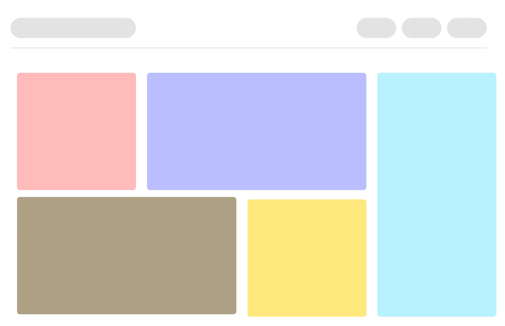

# React Intro

React is a JavaScript library built by Facebook. It is used for building front-end user interfaces. The main feature of react is that it makes your UI more modular, by enabling you to divide your interface in smaller components. This model of thinking fits user interfaces well.

React has literally changed the way we think about web applications and user interface development and made it possible to build and manage large-scale web applications such as Facebook, Netflix and many more in a more-efficient and modular way.

## How does it work?

Instead of jumping directly, into just learning react, we should first have at least an idea about how it actually works under the hood.

To keep it brief and simple, In layman terms, what react does is that instead of manipulating the web browser’s DOM directly, It creates this Virtual DOM in memory, where it does all these manipulations.

It then examines what changes have been made in the __Virtual DOM__ and then applies those changes in the browser’s DOM.


Let’s discuss about some important concepts.

### A. Components

Components are the most fundamental building blocks of a react application. In React, a single web page can be divided into small blocks that represent a different part of the screen. Consider the layout below for an example.

Here every colored box that you can see, represents a different component. Each individual component is independent of one another and responsible both for it’s visual appearances and its interactions.



In layman terms, a component is basically just a file that contains all the html, styling and js logic in one group.

### B. JSX

Since React uses JavaScript, you might be wondering, how we’ll be able to create and render elements on the screen. For creating a basic element through vanilla javascript, we usually use

```js
var header = document.createElement("h1");
header.innerHTML = "Hello World !";
````

Although this approach is totally okay and we can still use this one in React, but you can imagine, how cluttered our code would look?

Just to give you can example, let’s try creating an unordered list, consisting of three elements, in the casual way.

```js
const List = () => {
  const alphabets = ["a", "b", "c"];
  return React.createElement(
    "div",
    null,
    React.createElement("h2", null, "Alphabets"),
    React.createElement(
      "ul",
      null,
      alphabets.map((item) => {
        return React.createElement(
        "li",
         { className: "alphabet" },
         item
        );
      })
    )
  );
};
```

Looks scary for accomplishing such a simple task, right? Now, Let’s try achieving the same in the JSX way.

```js
const List = () => {
  const alphabets = ["a", "b", "c"];
  return(
    <div>
      <h2>Alphabets</h2>
      <ul>
        {alphabets.map(item=>
          <li className="alphabet">item</li>
        )}
      </ul>
    </div>
  )
}
```

Noticed the difference? So much less boilerplate and somewhat more elegant code. That’s __JSX__.

At first sight, you might be thinking, this looks like HTML. You are not alone, every new React developer thinks the same at first. I also thought the same.

But, the funny thing is, __it’s not HTML__. It is just a syntax extension to JavaScript, or you can say some sugar syntax for defining components and their positioning inside the markup. If you’d like to learn more in depth about JSX, [refer to React docs](https://reactjs.org/docs/introducing-jsx.html).

### C. Component State

If you try to read the react documentation to figure out what state is, it can be quite difficult to grasp at first. This is why usually many of the beginner tutorials out there, tend not to cover this concept. But in my opinion, it’s not that complicated and super simple to grasp and I believe it’s a very important concept to learn for everyone who’s trying to learn react.

You can imagine state of a component as the output of that component on the basis of some particular data, or a variable let’s suppose. For example, In case of an hour clock, the output of the component must change after every single hour let’s say from 1 AM to 2 AM. So, the output of that clock component at 1 AM, can be referred to as a state of that component.

Or another example, In case someone tries to visit your website and you want to display a login page to the visitor, in case they aren’t logged in and display a dashboard instead, when they are logged in. Here the boolean condition whether a user is logged in or not can be referred to as state of that component.

> __It’s important to remember that whenever the state of a component changes, the component will re-render itself__. For example, once a user has logged in we’d want to take him to the dashboard, instead of the login page.

More information:

- <https://medium.com/javascript-scene/the-missing-introduction-to-react-62837cb2fd76>
- <https://reactjs.org/tutorial/tutorial.html>
- <https://blog.ishandeveloper.com/react-intro>
