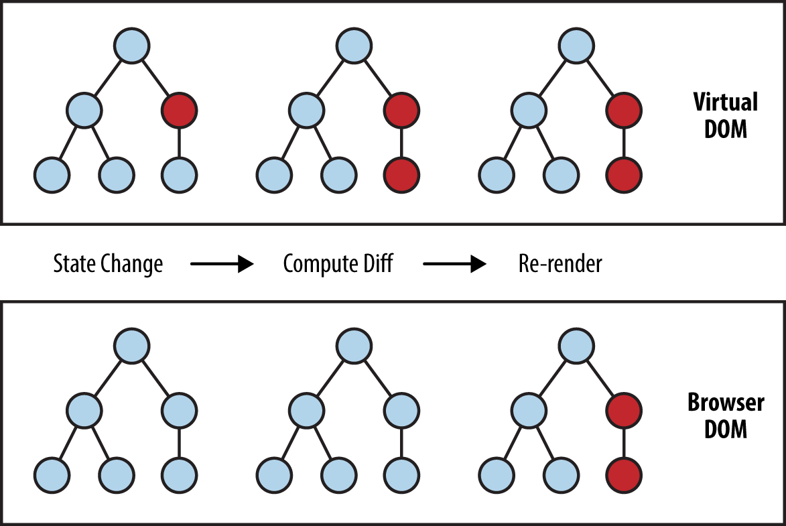

# React Intro

React is a JavaScript library built by Facebook. It is used for building front-end user interfaces. The main feature of react is that it makes your UI more modular, by enabling you to divide your interface in smaller components. This model of thinking fits user interfaces well.

React has literally changed the way we think about web applications and user interface development and made it possible to build and manage large-scale web applications such as Facebook, Netflix and many more in a more efficient and modular way.

## React concepts

Instead of jumping directly, we should first have at least an idea about how it actually works under the hood.

To keep it brief and simple, in layman terms, what react does is that instead of manipulating the web browser’s DOM directly, It creates this Virtual DOM in memory, where it does all these manipulations.

It then examines what changes have been made in the **Virtual DOM** and then applies those changes in the browser’s DOM.



Here are a few React concepts you should be aware of:

### Components

Components are the most fundamental building blocks of a react application. In React, a single web page can be divided into small blocks that represent a different part of the screen. Consider the layout below for an example.

Here every colored box that you can see, represents a different component. Each individual component is independent of one another and responsible both for it’s visual appearances and its interactions.


In layman terms, a component is basically just a file that contains all the html, styling and js logic in one group.

### JSX

Since React uses JavaScript, you might be wondering, how we’ll be able to create and render elements on the screen. For creating a basic element through vanilla javascript, we could use:

```js
var header = document.createElement("h1");
header.innerHTML = "Hello World!";
```

In react we can also create elements programatically by using `React.createElement` like so:

```js
const header = React.createElement("h1", null, "Hello World!");
```

This becomes fairly difficult to read however when you start nesting multiple elements as you can see in the following example:

```js
const List = () => {
  const alphabets = ["a", "b", "c"];
  return React.createElement(
    "div",
    null,
    React.createElement("h2", null, "Alphabets"),
    React.createElement(
      "ul",
      null,
      alphabets.map((item) => {
        return React.createElement("li", { className: "alphabet" }, item);
      })
    )
  );
};
```

Looks scary for accomplishing such a simple task, right? Now, Let’s try achieving the same in the JSX way.

```jsx
const List = () => {
  const alphabets = ["a", "b", "c"];
  return (
    <div>
      <h2>Alphabets</h2>
      <ul>
        {alphabets.map((item) => (
          <li className="alphabet">item</li>
        ))}
      </ul>
    </div>
  );
};
```

Noticed the difference? So much less boilerplate and somewhat more elegant code. That’s **JSX**.

At first sight, you might be thinking, this looks like HTML. You are not alone, every new React developer thinks the same at first. I also thought the same. What happens is that the jsx syntax get directly translated to the previous code as first step in compilation

But, the funny thing is, **it’s not HTML**. It is just a syntax extension to JavaScript, or you can say some sugar syntax for defining components and their positioning inside the markup. If you’d like to learn more in depth about JSX, [refer to React docs](https://reactjs.org/docs/introducing-jsx.html).

### Component State

In react the view is a derivative of the state. That is to say, if the state of a component is the same, the resulting output of the render function should be the same. When the state changes, the view will update to reflect this.

The state of a component is comprised of two parts, the internal state of the component and `props` which are input received from it's parent component.

#### Internal state

To use internal state of a react component, you can use the `useState` function provided by react. This function returns the current state, and a function to update it. Calling the setState function will cause the component to re-render.

```jsx
function HelloWorld() {
  // state and setState can be called whatever you want
  // useState can be used multiple times in the same component
  const [state, setState] = useState("...");

  return <h1 onClick={() => setState("world!")}>Hello {state}</h1>;
}
```

#### Props

In react, state that is passed into a component by it's parent are referred to as props. If the props change the component will re-render itself. The attributes you give to a component in jsx are accessable via the props input parameter.

```jsx
function HelloWorld(props) {
  return <h1>Hello {props.name}</h1>;
}

function App() {
  return <HelloWorld name="world!"></HelloWorld>;
}
```

#### Comparisons with Angular

When compared to Angular `props` are equivalent to fields with the `@Input` decorator, and internal state are private fields of the component.

> **It’s important to remember that whenever the state of a component changes, the component will re-render itself**

## Summary

If you want to read more about React, here are some useful links:

- <https://medium.com/javascript-scene/the-missing-introduction-to-react-62837cb2fd76>
- <https://reactjs.org/tutorial/tutorial.html>
- <https://blog.ishandeveloper.com/react-intro>
