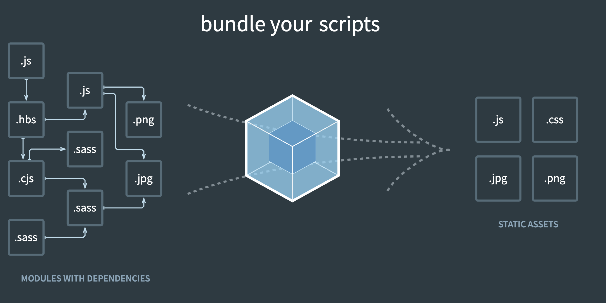

# Webpack introduction

The entire dev community was involved in a constant quest of improving the overall user and developer experience around using and building javascript/web applications. Therefore, we saw a lot of new libraries and frameworks introduced.

A few design patterns also evolved over time to give developers a better, more powerful yet very simple way of writing complex JavaScript applications. Websites before were no more just a small package with an odd number of files in them. They stated getting bulky, with the introduction of JavaScript modules, as writing encapsulated small chunks of code was the new trend. Eventually all of this lead to a situation where we had 4x or 5x the of files in the overall application package.

Not only was the overall size of the application a challenge, but also there was a huge gap in the kind of code developers were writing and the kind of code browsers could understand. Developers had to use a lot of helper code called polyfills to make sure that the browsers were able to interpret the code in their packages.

To answer these issues, webpack was created. Webpack is a static module bundler.

## So how was Webpack the answer?

In brief, Webpack goes through your package and creates what it calls a dependency graph which consists of various modules which your webapp would require to function as expected. Then, depending on this graph, it creates a new package which consists of the very bare minimum number of files required, often just a single bundle.js file which can be plugged in to the html file easily and used for the application.

## Summary

For an introduction with code examples on how to setup webpack and how it works read: [Webpack: A gentle introduction](https://ui.dev/webpack)

If you want to read more about Webpack, here are some useful links:

- <https://www.smashingmagazine.com/2017/02/a-detailed-introduction-to-webpack>
- <https://webpack.js.org/concepts/>
